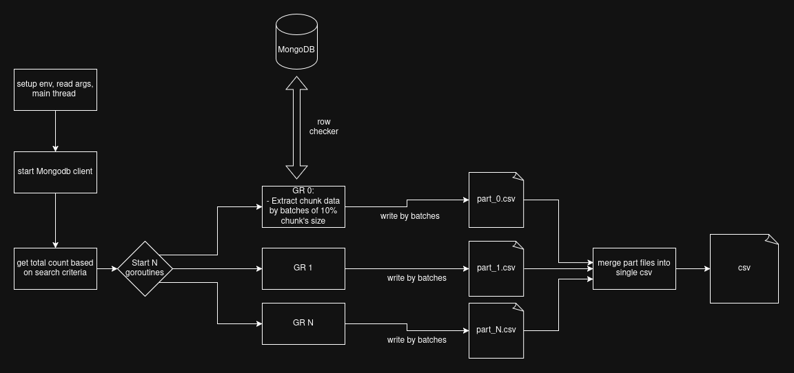

# Turbo ids

Multi thread tool to export mongodb data based on row checker.

## Diagram flow:

## Instructions:
- Add base criteria search in storage constructor (`newStorage` function) if needed
- Add new function in `rowCheckers.go`
- Modify `storage.go:104` were the rows are processed.
- Build and run

Fork from https://github.com/vicent-dev/exporter